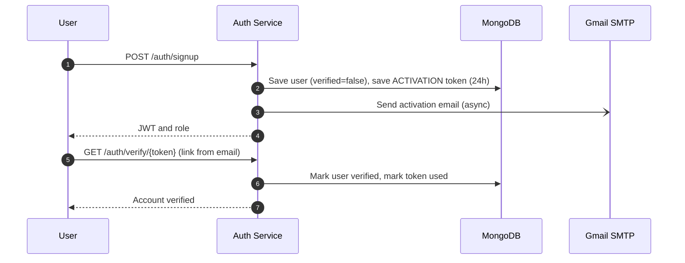
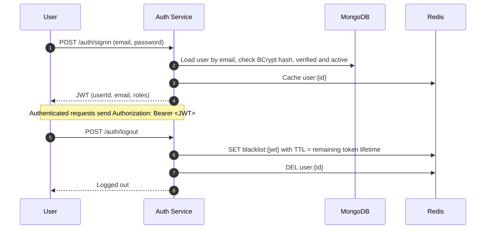
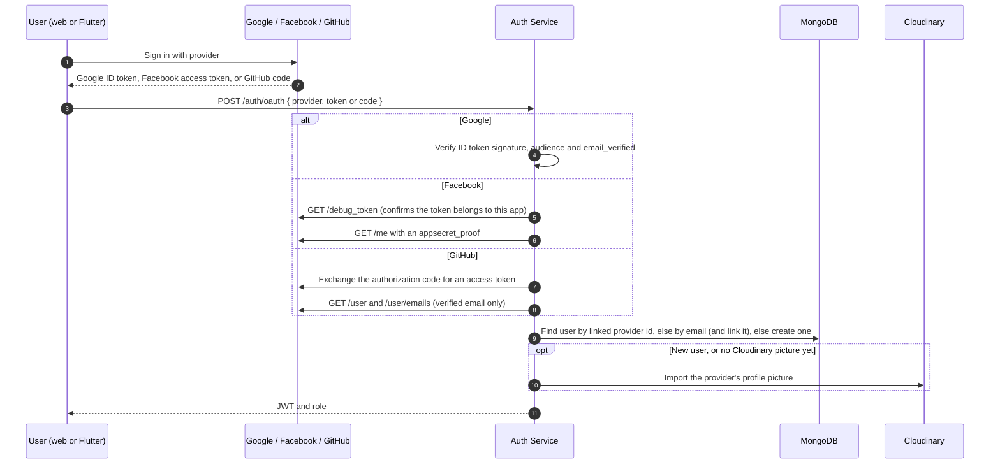

<p align="center">
  
</p>

<h1 align="center">Premisave Auth Service: Authentication, Identity &amp; User Management API</h1>

<p align="center">
  <b>A Spring Boot 4 &amp; MongoDB microservice that issues and revokes the JWTs every other Premisave service trusts, signs users in with email and password or with Google, Facebook and GitHub, and owns user accounts, profiles, social interactions, and location history for the Premisave property platform.</b>
</p>

<p align="center">
  <a href="https://github.com/peacemakerbill">
    
  </a>
  <br/>
  <sub>Built by <a href="https://github.com/peacemakerbill"><b>Bill Graham Peacemaker</b></a> (<code>@peacemakerbill</code>) · Backend Developer &amp; API Support Engineer · Nairobi, Kenya</sub>
</p>

<p align="center">
  
  
  
  
  
  
  
</p>

<p align="center">
  
  
  
  
  
  
</p>

<p align="center">
  <a href="https://github.com/peacemakerbill/premisave_auth_service/stargazers"></a>
  <a href="https://github.com/peacemakerbill/premisave_auth_service/network/members"></a>
  <a href="https://github.com/peacemakerbill/premisave_auth_service/issues"></a>
  <a href="https://github.com/peacemakerbill/premisave_auth_service/commits"></a>
  
  
  
</p>

<p align="center">
  <a href="#quick-start">Quick start</a> ·
  <a href="#architecture">Architecture</a> ·
  <a href="#authentication-flows">Authentication flows</a> ·
  <a href="#api-reference">API reference</a> ·
  <a href="#configuration-reference">Configuration</a> ·
  <a href="#troubleshooting">Troubleshooting</a>
</p>

> **If this saves you time building JWT authentication for Spring Boot microservices, please star the repo.** It helps other Kenyan developers find it.

> **Disclaimer.** This is an independent, community-built project shared as a portfolio and reference implementation. It is not affiliated with or endorsed by Google, Meta, Cloudinary, or any other third party it integrates with. Always follow each provider's own current documentation for credentials and production requirements.

---

## Table of contents

1. [What is this?](#what-is-this)
2. [Features](#features)
3. [Architecture](#architecture)
4. [Authentication flows](#authentication-flows)
5. [JWT contract for sibling services](#jwt-contract-for-sibling-services)
6. [Quick start](#quick-start)
7. [Build and run](#build-and-run)
8. [Configuration reference](#configuration-reference)
9. [API reference](#api-reference)
10. [Testing with Postman or curl](#testing-with-postman-or-curl)
11. [Roles and access control](#roles-and-access-control)
12. [Data model](#data-model)
13. [Going live](#going-live)
14. [Security notes](#security-notes)
15. [Project structure](#project-structure)
16. [Troubleshooting](#troubleshooting)
17. [Roadmap ideas](#roadmap-ideas)
18. [Contributing](#contributing)
19. [Author](#author)

---

## What is this?

**Premisave Auth Service** is the identity layer of the Premisave platform. Every user signs up, signs in, and manages their account here, and every other Premisave microservice (wallet, property, booking) trusts the JWTs this service issues rather than running its own login.

Concretely, it:

- registers users with email and password, verifies their address by email, and handles forgotten and changed passwords,
- signs users in with Google, Facebook or GitHub by verifying the provider's credential server-side, creating the account on first login and importing its profile picture,
- issues signed JWTs carrying the user's ID, email, and role, and revokes them on logout through a Redis blacklist,
- owns the user profile (names, contact details, language, profile picture on Cloudinary),
- provides the social layer used across the platform: likes, follows, star-rated reviews, and "who viewed my profile",
- records a user's location history,
- gives administrators a full user-management surface (create, edit, archive, activate, verify, change role, reset password),
- exposes a small, API-key-protected `/internal/**` API so sibling services can validate and look up users without a user JWT.

## Features

| | |
|---|---|
| **Email and password accounts** | Signup, activation by emailed link (24-hour token), resend activation, forgot and reset password, change password. |
| **Social sign-in** | Google (ID token verified with Google's verifier and your client ID), Facebook (access token checked with the Graph API's debug_token endpoint to confirm it belongs to your app, then read with appsecret_proof), and GitHub (authorization code exchanged server-side, or a client-supplied token checked against GitHub's check-token API). New users are created verified, with a unique username and their provider picture imported to Cloudinary. Signing in again with an email that already exists links the provider to that account. Each provider is independently optional: the service starts normally with any subset configured. |
| **Stateless JWT auth** | HS256-signed tokens with `userId`, `email`, and `roles` claims, shared by every Premisave service. |
| **Real logout** | Logged-out tokens are blacklisted in Redis until their natural expiry. |
| **Profiles** | Self profile, public profile of another user (contact details stripped), search, and discovery listing. |
| **Profile pictures** | Validated image upload (JPEG, PNG, GIF, WEBP) pushed to Cloudinary on a background thread with a 400x400 transformation. |
| **Social graph** | Likes, follows, mutual-follow check, 1 to 5 star reviews with comments, and aggregate stats per user. |
| **Profile views** | Records views (deduplicated to one per viewer per 24 hours), with "who viewed me", "who I viewed", and view statistics. |
| **Location history** | Current location plus full history, newest first. |
| **Admin user management** | Role-gated CRUD, archive, activate, verify, role changes with a last-admin safeguard, and password management. |
| **Internal service API** | Email validation and user-detail lookup for sibling services, protected by `X-API-Key`. |
| **Rate limiting** | Token-bucket throttling with Bucket4j on signup, signin, password reset, and social write endpoints. |
| **HTML email templates** | Activation and password-reset emails sent asynchronously over SMTP. |

## Architecture

```
┌──────────────┐   email/password,   ┌──────────────────────────┐      ┌──────────────┐
│   End User   │   Google, Facebook  │                          │ ───► │   MongoDB    │
│ (web/Flutter)│ ──────────────────► │   Premisave Auth Service │      ├──────────────┤
└──────────────┘ ◄────── JWT ─────── │    (this repository)     │ ───► │ Redis        │
                                     │                          │      │ (blacklist,  │
┌──────────────┐    X-API-Key        │  /auth  /profile         │      │  user cache) │
│wallet-service│ ──────────────────► │  /social /location       │      ├──────────────┤
└──────────────┘  /internal/users    │  /admin  /internal       │ ───► │ Gmail SMTP   │
                                     └──────────────────────────┘      ├──────────────┤
┌──────────────┐                                  │                    │ Cloudinary   │
│property-serv.│  validate the same JWT           │                    ├──────────────┤
│booking-serv. │  with the shared JWT_SECRET ◄────┘                    │ Google /     │
└──────────────┘                                                       │ Facebook     │
                                                                       └──────────────┘
```

**Design choices**

- **One identity provider for the whole platform.** Other services never store passwords or run login flows; they validate this service's JWTs with the shared secret and read the `userId` and `roles` claims.
- **Email is the login identity.** `User.getUsername()` returns the email address for Spring Security, so the JWT subject is always the email. The display username is a separate, editable field.
- **Two separate trust boundaries.** End users authenticate with JWTs. Service-to-service calls use a shared `X-API-Key` on `/internal/**`, handled by its own filter, so the two never mix.
- **OAuth by credential verification, not backend redirects.** The frontend completes the sign-in itself — Google and Facebook's own SDKs, or GitHub's OAuth App authorization flow — and sends the resulting token or code to `POST /auth/oauth`. Every client secret stays server-side; only Google's client ID and GitHub's client ID are ever exposed to a frontend. This keeps the backend stateless and works identically for web and Flutter clients.
- **One client class per provider.** `GoogleOAuthClient`, `FacebookOAuthClient` and `GitHubOAuthClient` each implement the same small interface and are the only things that know a given provider's API shape. Adding a fourth provider means adding one more implementation, not touching the other three.

## Authentication flows

### Signup and email verification



Until the account is verified, sign-in is rejected because Spring Security treats the user as disabled.

### Sign-in and logout



Every request passes through `JwtAuthenticationFilter`, which rejects blacklisted tokens with `401` before validating the signature and expiry.

### Google, Facebook and GitHub sign-in



Each provider is independently optional. `oauth.google.client-id`, `oauth.facebook.app-id`/`app-secret`, and `oauth.github.client-id`/`client-secret` all default to blank, so the service starts with any subset configured; requesting an unconfigured provider returns a clear error instead of the service failing to boot.

Signing in with a provider whose email already matches an existing account links that provider to the account (and marks it verified) rather than creating a duplicate. A provider picture is copied into Cloudinary — not linked directly — because some providers' picture URLs (Facebook's in particular) are signed and expire.

### Password reset

`POST /auth/forgot-password` emails a link to `{FRONTEND_URL}/reset-password?token=...`. The frontend posts the token and the new password to `POST /auth/reset-password`. Tokens are single-use and expire after 24 hours.

## JWT contract for sibling services

| Item | Value |
|---|---|
| Algorithm | HS256 |
| Signing key | `JWT_SECRET`, Base64-decoded, then truncated or zero-padded to exactly 32 bytes |
| `sub` | User's email |
| `userId` | MongoDB user ID |
| `email` | User's email |
| `roles` | Single role name, for example `CLIENT` or `ADMIN` |
| Lifetime | `JWT_EXPIRATION` in milliseconds (default 30 days) |

Any service that validates these tokens must use the **same `JWT_SECRET` and the same 32-byte key derivation**, otherwise signatures will not match.

## Quick start

### Prerequisites

- **Java 21**
- **Maven 3.9+**
- **MongoDB** running locally, in Docker, or on Atlas
- **Redis** running locally or hosted
- A Gmail account with an **App Password** (or any SMTP server)
- A Cloudinary account
- Optional: a Google OAuth client ID, a Facebook app, or a GitHub OAuth App, for social sign-in — the service runs fine with none, some, or all of these configured

```bash
# 1. Clone
git clone https://github.com/peacemakerbill/premisave_auth_service.git
cd premisave_auth_service

# 2. Start MongoDB and Redis (skip if you already have them)
docker run -d --name auth-mongo -p 27017:27017 mongo:8
docker run -d --name auth-redis -p 6379:6379 redis:7

# 3. Copy the environment template, fill it in, then run
cp .env.example .env
mvn spring-boot:run
```

`.env` is loaded automatically at startup and holds every setting listed in `.env.example`: `MONGODB_URI`, `REDIS_HOST`/`REDIS_PORT`, `JWT_SECRET`, `JWT_EXPIRATION`, `API_KEY`, `FRONTEND_URL`, `BACKEND_URL`, the Gmail SMTP settings, the Cloudinary credentials, and the three optional OAuth provider settings. Generate `JWT_SECRET` with `openssl rand -base64 32` and `API_KEY` with `openssl rand -hex 32` — both are required, with no built-in default, so the service refuses to start without them.

`.env` itself must never be committed; only `.env.example` is meant to be tracked. Write values without quotes and without trailing spaces.

When the service is healthy you will see lines like:

```
Tomcat started on port 8080 (http) with context path '/'
Started PremisaveAuthServiceApplication in 4.971 seconds
```

`GET http://localhost:8080/health` returns a plain-text status banner.

## Build and run

```bash
# Compile and package an executable jar
mvn clean package

# Run it (environment variables or a .env in the working directory)
java -jar target/premisave_auth_service-0.0.1-SNAPSHOT.jar
```

**Notes**

- `.env` is loaded from the working directory at startup and copied into system properties, so real environment variables (Docker, Kubernetes, systemd) work the same way.
- The service starts on **port 8080** by default (`server.port` in `application.yml`).
- On first start an initial administrator account is seeded if none exists. **Change its password immediately.**

## Configuration reference

Every setting lives in `src/main/resources/application.yml` and can be overridden by an environment variable or `.env`.

| Environment variable | Default | Required | Description |
|---|---|---|---|
| `MONGODB_URI` | `mongodb://localhost:27017/premisave-auth` | no | MongoDB connection string. |
| `REDIS_HOST` / `REDIS_PORT` | `localhost` / `6379` | no | Redis for the token blacklist and user cache. |
| `JWT_SECRET` | none | **yes** | Base64 signing secret. Must match every Premisave service that validates tokens. |
| `JWT_EXPIRATION` | `2592000000` (30 days) | no | Token lifetime in milliseconds. |
| `API_KEY` | none | **yes** | Shared secret for `X-API-Key` on `/internal/**` and `/profile/public/directory`. Must equal `INTERNAL_API_KEY` in the wallet service. |
| `FRONTEND_URL` | `http://localhost:3000` | no | Base URL used in activation and reset-password email links. |
| `BACKEND_URL` | `http://localhost:8080` | no | This service's own public base URL. |
| `MAIL_HOST` / `MAIL_PORT` | `smtp.gmail.com` / `587` | no | SMTP server (STARTTLS). |
| `GMAIL_USERNAME` / `GMAIL_PASSWORD` | none | **yes** | SMTP credentials. For Gmail, use an App Password. |
| `SUPPORT_EMAIL` | none | no | Support address shown in email footers. |
| `CLOUDINARY_CLOUD_NAME` / `CLOUDINARY_API_KEY` / `CLOUDINARY_API_SECRET` | none | **yes** | Cloudinary credentials, used for both manual profile-picture uploads and importing an OAuth provider's picture. No built-in default. |
| `GOOGLE_CLIENT_ID` | blank (disabled) | no | Audience checked when verifying Google ID tokens. Comma-separate several client IDs (web, Android, iOS) to accept a token issued to any of them. Leave unset to disable Google sign-in without affecting anything else. |
| `FACEBOOK_APP_ID` / `FACEBOOK_APP_SECRET` | blank (disabled) | no | Facebook app credentials, used to confirm a token belongs to this app (`/debug_token`) and to sign Graph API calls (`appsecret_proof`). Leave both unset to disable Facebook sign-in. |
| `GITHUB_CLIENT_ID` / `GITHUB_CLIENT_SECRET` | blank (disabled) | no | GitHub OAuth App credentials, used to exchange an authorization code and to verify a client-supplied token belongs to this app. Leave both unset to disable GitHub sign-in. |
| `RATE_LIMIT_REQUESTS_PER_MINUTE` | `20` | no | Bucket capacity and refill rate for rate-limited endpoints. |

`JWT_SECRET`, `API_KEY`, and the three Cloudinary variables have no default in `application.yml` and must come from `.env` or the environment — the service fails to start without them. The three OAuth providers are the opposite: each defaults to blank and is simply unavailable via `/auth/oauth` until configured, so a missing or misconfigured provider can never take down the whole service.

Also configurable in `application.yml`: `spring.servlet.multipart.max-file-size` (default `10MB`) and `profile-views.max-history-size` (default `20`).

## API reference

Base URL (local): `http://localhost:8080`

| Namespace | Auth | Purpose |
|---|---|---|
| `/auth/**` | Public (except logout and change-password) | Signup, signin, OAuth, tokens, verification, passwords |
| `/profile/**` | JWT | Own and other users' profiles, search, picture upload |
| `/profile/views/**` | JWT | Profile view tracking and statistics |
| `/social/**` | JWT | Likes, follows, reviews, stats |
| `/location/**` | JWT | Current location and history |
| `/admin/users/**` | JWT, `ADMIN` role | User management |
| `/internal/users/**` | `X-API-Key` | Service-to-service validation and lookup |

### Authentication

| Method | Path | Description |
|---|---|---|
| `POST` | `/auth/signup` | Register. Sends an activation email. Rate limited. |
| `POST` | `/auth/signin` | Email and password login. Rate limited. |
| `POST` | `/auth/oauth` | Google, Facebook or GitHub sign-in. Creates and links accounts, imports the provider picture. |
| `POST` | `/auth/logout` | Blacklist the bearer token. |
| `POST` | `/auth/refresh` | Exchange a still-valid token for a fresh one. |
| `GET` | `/auth/verify/{token}` | Verify an account from the emailed link. |
| `POST` | `/auth/resend-activation?email=` | Resend the activation email. |
| `POST` | `/auth/forgot-password` | Email a password-reset link. Rate limited. |
| `POST` | `/auth/reset-password` | Set a new password with a reset token. Rate limited. |
| `POST` | `/auth/change-password` | Change password while signed in. |

#### `POST /auth/signup`

```json
{
  "username": "janedoe",
  "firstName": "Jane",
  "middleName": "W",
  "lastName": "Doe",
  "email": "jane@example.com",
  "phoneNumber": "+254712345678",
  "country": "Kenya",
  "language": "ENGLISH",
  "password": "S3cure!pass"
}
```

Response (`200`):

```json
{
  "token": "eyJhbGciOiJIUzI1NiJ9...",
  "role": "CLIENT",
  "refreshToken": null
}
```

#### `POST /auth/oauth`

```json
{ "provider": "google", "token": "<ID token from Google Sign-In>" }
```

```json
{ "provider": "facebook", "token": "<access token from Facebook Login>" }
```

```json
{ "provider": "github", "code": "<authorization code>", "redirectUri": "<redirect_uri used to request the code>" }
```

GitHub also accepts an access token directly instead of a code:

```json
{ "provider": "github", "token": "<GitHub access token issued to this OAuth app>" }
```

Returns the same `AuthResponse` shape as signin. An unconfigured or misused provider returns `400` with a plain message, for example `"Facebook sign-in is not configured on this server"` or `"This email is already linked to a different Google account"`.

### Profile

| Method | Path | Description |
|---|---|---|
| `GET` | `/profile/me` | Current user's full profile, including a computed `fullName`. |
| `GET` | `/profile/user/{userId}` | Another user's profile. |
| `GET` | `/profile/search?query=` | Search active users by name, username, email, or phone. |
| `GET` | `/profile/all` | All active, non-archived users (contact details stripped). |
| `PUT` | `/profile/update` | Partial profile update. |
| `POST` | `/profile/upload-profile-picture` | Multipart upload, form field `file`. |
| `POST` | `/profile/change-password` | Change password (current, new, confirm). |
| `GET` | `/profile/public/directory` | Directory of active users. Requires `X-API-Key`. |

### Profile views

| Method | Path | Description |
|---|---|---|
| `POST` | `/profile/views/{targetId}` | Record a view (once per viewer per target per 24 hours). |
| `GET` | `/profile/views/who-viewed-me` | Latest 20 viewers. |
| `GET` | `/profile/views/who-i-viewed` | Profiles the current user viewed. |
| `GET` | `/profile/views/my-stats` | Total, last 7 days, last 30 days, unique viewers. |
| `GET` | `/profile/views/stats/{userId}` | Another user's total views only. |

### Social

| Method | Path | Description |
|---|---|---|
| `POST` | `/social/like` | Like a user (`targetId`). Rate limited. |
| `DELETE` | `/social/unlike/{targetId}` | Remove a like. |
| `POST` | `/social/follow` | Follow a user (`targetId`). Rate limited. |
| `DELETE` | `/social/unfollow/{targetId}` | Unfollow. |
| `POST` | `/social/review` | Review a user (`targetId`, `rating` 1 to 5, `comment`). Rate limited. |
| `PUT` | `/social/review` | Edit own review (`reviewId`). |
| `DELETE` | `/social/review/{reviewId}` | Delete own review. |
| `GET` | `/social/reviews/{targetId}` | Reviews of a user. |
| `GET` | `/social/stats/{userId}` | Followers, following, likes, average rating, review count. |
| `GET` | `/social/my-likes`, `/social/my-following` | Users I liked or follow. |
| `GET` | `/social/my-likers`, `/social/my-followers` | Users who liked or follow me. |
| `GET` | `/social/my-reviews`, `/social/my-written-reviews` | Reviews about me and by me. |
| `GET` | `/social/{like,follow,review}/status/{targetId}` | Whether I liked, follow, or reviewed a user. |
| `GET` | `/social/follow/mutual/{targetId}` | Whether the follow is mutual. |

### Location

| Method | Path | Description |
|---|---|---|
| `PUT` | `/location` | Set the current location. The previous one is kept as history. |
| `GET` | `/location/current` | Current location. |
| `GET` | `/location/history?limit=100` | History, newest first (maximum 500). |

### Admin user management

All under `/admin/users`, `ADMIN` role required.

| Method | Path | Description |
|---|---|---|
| `GET` | `/admin/users`, `/active`, `/archived` | List users. |
| `GET` | `/{id}`, `/email/{email}` | Get one user. |
| `POST` | `/create` | Create a user. |
| `PUT` | `/update/{id}` | Update a user. |
| `DELETE` | `/delete/{id}` | Delete a user. |
| `PUT` | `/archive/{id}`, `/unarchive/{id}` | Archive state. |
| `PUT` | `/activate/{id}`, `/deactivate/{id}` | Active state. |
| `PUT` | `/verify/{id}`, `/unverify/{id}` | Verification state (admins cannot be unverified). |
| `PUT` | `/change-role/{id}` | Change role. The last remaining admin cannot be demoted. |
| `PUT` | `/update-password/{id}` | Set a password (strength rules enforced). |
| `PUT` | `/reset-password/{id}` | Reset to a temporary password. |
| `POST` | `/search` | Search users. |
| `GET` | `/exists/email/{email}`, `/exists/username/{username}` | Availability checks. |

### Internal (service-to-service)

| Method | Path | Description |
|---|---|---|
| `GET` | `/internal/users/validate-email/{email}` | Always `200` with `{ "valid": bool, "reason": "..." }`. Reasons: `NOT_FOUND`, `INACTIVE`, `UNVERIFIED`, `ARCHIVED`, `INVALID_FORMAT`. |
| `GET` | `/internal/users/{email}/details` | `id`, `email`, `role`, `active`, `verified`, name fields and `fullName`. `404` if not found. |

Both require `X-API-Key`. The wallet service calls `validate-email` during M-Pesa C2B validation and `details` to put real names on transfer and payment emails.

## Testing with Postman or curl

```bash
BASE=http://localhost:8080

# Sign in and capture the token
TOKEN=$(curl -s -X POST "$BASE/auth/signin" \
  -H "Content-Type: application/json" \
  -d '{"email":"jane@example.com","password":"S3cure!pass"}' | jq -r .token)

# Current profile
curl -s "$BASE/profile/me" -H "Authorization: Bearer $TOKEN"

# Follow another user
curl -s -X POST "$BASE/social/follow" \
  -H "Authorization: Bearer $TOKEN" \
  -H "Content-Type: application/json" \
  -d '{"targetId":"<user id>"}'

# Upload a profile picture
curl -s -X POST "$BASE/profile/upload-profile-picture" \
  -H "Authorization: Bearer $TOKEN" \
  -F "file=@avatar.jpg"

# Internal lookup, as the wallet service does it
curl -s -H "X-API-Key: $API_KEY" "$BASE/internal/users/jane@example.com/details"

# Log out (the token stops working immediately)
curl -s -X POST "$BASE/auth/logout" -H "Authorization: Bearer $TOKEN"
```

**Collection variables worth saving in Postman:** `base_url_auth`, `jwt_token`, `api_key`, `test_user_id`, `test_user_email`.

## Roles and access control

| Role | Intended for |
|---|---|
| `CLIENT` | Default for new users, tenants and buyers. |
| `HOME_OWNER` | Property owners and landlords. |
| `ADMIN` | Full platform administration, including `/admin/**` here. |
| `OPERATIONS` | Operations staff (enforced by sibling services). |
| `FINANCE` | Finance staff (enforced by sibling services, for example wallet reports). |
| `SUPPORT` | Customer support staff. |

Spring Security authorities are the role name prefixed with `ROLE_`, so `hasRole('ADMIN')` matches `ADMIN`.

## Data model

MongoDB collections:

| Collection | Purpose |
|---|---|
| `users` | Accounts, profile fields, role, `active` / `verified` / `archived` flags, audit timestamps, last login. |
| `tokens` | Single-use activation and password-reset tokens with expiry. |
| `likes` | One document per (user, target), unique index. |
| `followers` | One document per (followed user, follower), unique index. |
| `reviews` | Star rating and comment per (reviewer, target). |
| `profile_views` | Viewer, target, device type, source, timestamp. |
| `user_locations` | Location history with a single `isCurrent` entry per user. |

A user can sign in only when `active` and `verified` are both true. Archived users are excluded from search, discovery, and internal validation.

## Going live

1. **Serve over HTTPS** behind a reverse proxy or load balancer.
2. **Use freshly generated secrets for `JWT_SECRET`, `API_KEY`, and the Cloudinary credentials in production's `.env`.** `application.yml` no longer ships with a fallback for any of these, so a deployment fails fast if one is missing — but that only protects you from a missing secret, not a reused one. Never reuse a value that was ever committed to git or pasted anywhere outside your own secret store.
3. **Fix the signup role field before allowing public registration.** `POST /auth/signup` currently honours a client-supplied `role`, so anyone can self-register as `ADMIN`. See Roadmap.
4. **Restrict CORS.** The default configuration allows every origin for development. Limit it to your real frontend domains.
5. **Change the seeded administrator's password** on first boot.
6. **Turn down logging.** Disable `mail.debug` and set `com.premisave.auth` and Spring Data MongoDB logging back to `INFO`.
7. **Restrict `/internal/**`** at the network layer where possible, in addition to the API key.
8. **Register production redirect URIs** with each OAuth provider you enable — GitHub in particular rejects a code exchange whose `redirectUri` doesn't exactly match what's registered on the OAuth App.

## Security notes

- **Passwords** are hashed with BCrypt. OAuth-created accounts get a random, BCrypt-encoded password no one knows.
- **JWTs** are stateless and signed with HS256. Logout adds the token to a Redis blacklist for the rest of its lifetime.
- **Malformed tokens** are logged and treated as unauthenticated rather than causing a server error.
- **Internal API key** authentication is handled by a dedicated filter on `/internal/**` and `/profile/public/directory` only.
- **Google ID tokens** are verified for signature, audience and `email_verified` before the email is trusted.
- **Facebook access tokens** are checked with `/debug_token` to confirm they were issued to this app — not just that they're valid — before anything else runs, so a token from a different Facebook app can't be replayed here.
- **GitHub authorization codes** are exchanged for an access token entirely server-side; the client secret never reaches the frontend. A client-supplied token is only accepted after GitHub's check-token API confirms it belongs to this app.
- **Archived and deactivated accounts** are blocked from every sign-in path, including OAuth, not just email and password.
- **No secrets ship with defaults.** `JWT_SECRET`, `API_KEY`, and the Cloudinary credentials must come from the environment; the service won't start with a placeholder in their place.
- **Reset and activation tokens** are random UUIDs, single use, and expire after 24 hours.
- **Role-based access** protects `/admin/**`, and every user-facing controller requires authentication.
- **Stateless sessions** with no server-side session state, so the service scales horizontally.

**Known gap:** `SignupRequest.role` is honoured as sent by the client, so `POST /auth/signup` currently lets anyone self-assign any role, including `ADMIN`. Fix before going live by ignoring the field and always assigning `Role.CLIENT` server-side (see Roadmap).

## Project structure

```
premisave_auth_service/
├── src/main/java/com/premisave/auth/
│   ├── config/          # Security, Redis, Mongo auditing, mail, Cloudinary, async, rate limiting, OAuth RestClient, admin seeding
│   ├── controller/      # Auth, profile, profile views, social, location, admin, internal, home
│   ├── dto/             # Request and response DTOs, including OAuthRequest/OAuthUserInfo
│   ├── entity/          # User (with googleId/facebookId/githubId), Token, Like, Follower, Review, ProfileView, UserLocation
│   ├── enums/           # Role, TokenType, Language
│   ├── exception/       # Global exception handler
│   ├── repository/      # Spring Data MongoDB repositories
│   ├── security/        # JWT service and filter, API key filter, UserDetailsService
│   ├── service/         # Business logic, email, profile picture storage
│   │   └── oauth/       # OAuthProviderClient + one implementation per provider (Google, Facebook, GitHub)
│   ├── util/            # Rate limiter interceptor
│   └── PremisaveAuthServiceApplication.java
├── src/main/resources/
│   ├── application.yml
│   ├── templates/       # activation-email.html, reset-password-email.html
│   └── META-INF/additional-spring-configuration-metadata.json
├── .env.example         # Committable environment template — copy to .env and fill in
└── pom.xml
```

## Troubleshooting

<details>
<summary><b>Sign-in returns 400 "User is disabled"</b></summary>

The account is either not verified or deactivated. Check the activation email, use `POST /auth/resend-activation`, or have an admin call `PUT /admin/users/verify/{id}`.
</details>

<details>
<summary><b>Activation or reset emails never arrive</b></summary>

For Gmail, `GMAIL_PASSWORD` must be an App Password, not your normal password, and the account needs 2-Step Verification enabled. Email is sent asynchronously, so failures appear in the logs rather than in the API response. Also check that `FRONTEND_URL` is correct, since the links are built from it.
</details>

<details>
<summary><b>401 "Token has been revoked. Please login again."</b></summary>

That token was logged out and is on the Redis blacklist. Sign in again to get a new one.
</details>

<details>
<summary><b>401 "Missing or invalid API key" from /internal/**</b></summary>

The caller's `X-API-Key` must equal this service's `API_KEY`. In the wallet service the same value is configured as `INTERNAL_API_KEY`.
</details>

<details>
<summary><b>Other services reject tokens issued here</b></summary>

They must use the same `JWT_SECRET` and derive the key the same way (Base64-decode, then truncate or zero-pad to 32 bytes). A difference in either produces signature failures.
</details>

<details>
<summary><b>The service won't start: "Could not resolve placeholder ..."</b></summary>

`JWT_SECRET`, `API_KEY`, and the three `CLOUDINARY_*` variables have no default and are required — the service refuses to start without them. Copy `.env.example` to `.env` and fill in real values; the three OAuth providers are the only settings that are genuinely optional.
</details>

<details>
<summary><b>400 "&lt;Provider&gt; sign-in is not configured on this server"</b></summary>

That provider's environment variables are unset (blank by default), so the service started fine but that one sign-in method is disabled. Set `GOOGLE_CLIENT_ID`, or both `FACEBOOK_APP_ID`/`FACEBOOK_APP_SECRET`, or both `GITHUB_CLIENT_ID`/`GITHUB_CLIENT_SECRET`, and restart.
</details>

<details>
<summary><b>400 "This email is already linked to a different &lt;Provider&gt; account"</b></summary>

An account with that email already exists and is linked to a different provider account than the one signing in — for example, they signed up with Google, and a different GitHub account happens to share the same email. This is a genuine conflict; there's no automatic resolution.
</details>

<details>
<summary><b>GitHub sign-in fails with "did not return a verified email"</b></summary>

Request the `user:email` scope when starting the GitHub OAuth flow, and make sure the GitHub account has at least one verified email address. A public profile email that isn't verified is not accepted.
</details>

<details>
<summary><b>429 Too Many Requests on signin or signup</b></summary>

The rate-limited endpoints share one token bucket sized by `RATE_LIMIT_REQUESTS_PER_MINUTE`. Wait a minute or raise the limit for local testing.
</details>

<details>
<summary><b>New profile picture URL returns 404 for a few seconds</b></summary>

The URL is saved and returned immediately while the actual Cloudinary upload runs in the background. If it keeps returning 404, check the logs for an async upload failure and your Cloudinary credentials.
</details>

<details>
<summary><b>"Name for argument of type ... not specified" at runtime</b></summary>

Some `@RequestParam`s rely on compiled parameter names. Maven builds with `-parameters` through the Spring Boot parent. In Eclipse or STS, enable "Store information about method parameters" in the Java Compiler settings, then run a Maven update.
</details>

## Roadmap ideas

Real, currently-known gaps and follow-ups, not commitments:

- [ ] `POST /auth/signup` trusts the client-supplied `role`, allowing self-registration as `ADMIN` — ignore the field and always assign `Role.CLIENT` server-side
- [ ] Issue dedicated long-lived refresh tokens at signin (the response field exists but is not populated yet)
- [ ] Per-client rate limiting backed by Redis instead of a single in-memory bucket shared by all callers
- [ ] An unlink/manage-connections endpoint for social accounts — currently a linked Google, Facebook or GitHub account can't be removed via the API
- [ ] Lock CORS down to configured origins instead of allowing every origin
- [ ] Email the temporary password on admin password reset instead of a fixed default
- [ ] Align password rules across signup, reset, change, and admin flows
- [ ] Geo-indexed nearby-user search on top of the location history
- [ ] OpenAPI documentation with springdoc
- [ ] Automated tests for the signup, OAuth, logout, and internal API paths

## Contributing

This is a proprietary service for the Premisave platform. If you have been granted access to contribute:

1. Fork the repository and create a branch: `git checkout -b feature/my-improvement`
2. Make your change and keep the code style consistent.
3. Commit with a clear message and open a pull request describing what and why.

Found a bug or have a question? [Open an issue](https://github.com/peacemakerbill/premisave_auth_service/issues).

## Author

<table>
  <tr>
    <td align="center" width="180">
      <a href="https://github.com/peacemakerbill">
        <br/>
        <sub><b>Bill Graham Peacemaker</b></sub>
      </a>
    </td>
    <td>
      <b>Backend Developer &amp; API Support Engineer at Safaricom PLC</b><br/>
      Nairobi, Kenya<br/><br/>
      Enterprise systems developer and API integration specialist, working across backend microservices (Java/Spring Boot), Flutter frontends, and DevOps, with deep hands-on experience in Safaricom's M-Pesa Daraja APIs.<br/><br/>
      <a href="https://github.com/peacemakerbill"></a>
      <a href="https://github.com/peacemakerbill?tab=followers"></a>
      <br/><br/>
      More from me: <a href="https://github.com/peacemakerbill/premisave-wallet-service">premisave-wallet-service</a> ·
      <a href="https://github.com/peacemakerbill/premisave-c2b-hakikisha-service-m-pesa">premisave-c2b-hakikisha-service-m-pesa</a> ·
      <a href="https://github.com/peacemakerbill/premisave_flutter_frontend">premisave_flutter_frontend</a> ·
      <a href="https://github.com/peacemakerbill?tab=repositories">all repositories</a>
    </td>
  </tr>
</table>

### Star history

<a href="https://star-history.com/#peacemakerbill/premisave_auth_service&Date">
  
</a>

---

<details>
<summary>Search keywords</summary>

Spring Boot authentication microservice · Spring Security 7 JWT · stateless JWT authentication Java · JWT logout Redis blacklist · Spring Boot 4 auth service · MongoDB user management Spring Boot · Google Sign-In backend verification Java · Facebook Login Graph API Java · GitHub OAuth App Java · OAuth account linking Spring Boot · OAuth token verification Spring Boot · email verification Spring Boot · password reset flow Java · Cloudinary Spring Boot upload · Bucket4j rate limiting · microservice identity provider · internal API key service-to-service auth · role-based access control Spring Security · social features API followers likes reviews · profile views API · Flutter backend authentication · property management platform Kenya · Premisave

</details>

<p align="center">
  <sub>Made in Nairobi, Kenya · <a href="https://github.com/peacemakerbill">@peacemakerbill</a></sub>
</p>